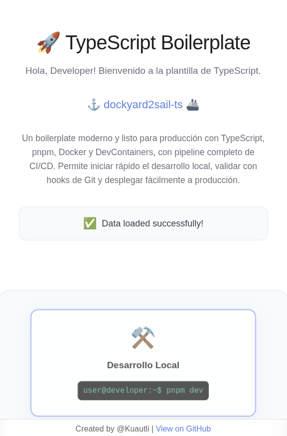

# ⚓ dockyard2sail-ts 🚢

_Un boilerplate moderno y listo para producción con TypeScript, Docker y DevContainers._

---


---

## 🌐 Documentación

- 🇪🇸 Español (principal)
- 🇬🇧 [English README](./docs/README_EN.md)

---

## 🌊 Características

- **TypeScript**: Soporte completo con chequeo estricto de tipos
- **pnpm**: Gestor de paquetes rápido y eficiente con soporte para workspaces
- **Vite**: Herramienta de construcción y servidor de desarrollo ultrarrápido
- **Vitest**: Framework de pruebas unitarias veloz
- **Docker**: Builds multi-stage para producción y contenedores de desarrollo
- **DevContainers**: Entorno completo de desarrollo con VS Code
- **Husky**: Hooks de Git para asegurar calidad de código
- **CI/CD Listo**: Scripts de validación e integración con GitHub Actions

---

## 🛳️ Estructura del Proyecto

```
├── .husky/                 # Hooks de Git
├── scripts/                # Scripts de construcción y validación
├── src/                    # Código fuente
│   ├── main.ts            # Punto de entrada principal
│   └── test/              # Archivos de prueba
├── docker-compose.yml      # Entorno de desarrollo
├── Dockerfile              # Build de producción
├── Dockerfile.dev          # Entorno de desarrollo
├── package.json            # Dependencias y scripts
├── tsconfig.json           # Configuración de TypeScript
├── vite.config.ts          # Configuración de Vite
└── vitest.config.ts        # Configuración de pruebas
```

---

## 🧭 Primeros Pasos

Al deployar la app deberías ver:



### Requisitos previos

- [Docker](https://www.docker.com/) y Docker Compose
- [VS Code](https://code.visualstudio.com/) (recomendado)
- [Extensión Dev Containers](https://marketplace.visualstudio.com/items?itemName=ms-vscode-remote.remote-containers)

### Opción 1: Usando DevContainers (Recomendado)

```bash
pnpm dev
```

### Opción 2: Usando Docker Compose

```bash
docker-compose up -d
docker-compose exec phaser-app bash
pnpm install
pnpm dev
```

### Opción 3: Desarrollo Local

```bash
npm install -g pnpm
pnpm install
pnpm dev
```

---

## ⚡ Scripts Disponibles

| Script               | Descripción                                   |
| -------------------- | --------------------------------------------- |
| `pnpm dev`           | Inicia el servidor de desarrollo              |
| `pnpm build`         | Construye para producción                     |
| `pnpm typecheck`     | Revisa los tipos de TypeScript                |
| `pnpm test`          | Ejecuta pruebas en modo watch                 |
| `pnpm test:run`      | Ejecuta pruebas una sola vez                  |
| `pnpm test:ui`       | Ejecuta pruebas con interfaz gráfica          |
| `pnpm test:coverage` | Ejecuta pruebas con cobertura                 |
| `pnpm preview`       | Previsualiza el build de producción           |
| `pnpm validate`      | Validación completa (tipos + pruebas + build) |

---

## 🐳 Comandos Docker

### Desarrollo

```bash
docker-compose up -d
docker-compose logs -f
docker-compose down
```

### Producción

```bash
docker build -t mi-app:latest .
docker run -p 8080:8080 mi-app:latest
```

---

## 🧭 Archivos de Configuración

- **TypeScript (tsconfig.json)**: Chequeo estricto, ES2022, alias de paths, source maps
- **Vite (vite.config.ts)**: HMR, optimización para producción, alias de paths
- **Testing (vitest.config.ts)**: Entorno JSDOM, reportes de cobertura, modo UI
- **Package Manager (.npmrc, .pnpmrc)**: Optimizado para CI/CD

---

## ⚓ Despliegue

```bash
pnpm build
docker build -t mi-app:latest .
docker push mi-registro/mi-app:latest
```

---

## 🔍 Calidad de Código

Incluye herramientas para asegurar la calidad:

- **Husky** + **lint-staged**
- **TypeScript estricto**
- **Vitest** para pruebas completas

---

## 📜 Buenas Prácticas

1. Mantener dependencias actualizadas
2. Escribir pruebas con buena cobertura
3. Usar TypeScript en modo estricto
4. Optimizar capas en Docker
5. Usar variables de entorno con Vite
6. Aprovechar los hooks de Git configurados

---

## 🤝 Contribuir

1. Haz un fork del repositorio
2. Crea una rama de feature
3. Realiza tus cambios
4. Ejecuta `pnpm validate`
5. Envía un Pull Request

---

## 📄 Licencia

Este proyecto está disponible bajo la licencia MIT.

---

Hecho con ❤️ en el ⚓ **Dockyard** → listo para 🚢 **Navegar**
